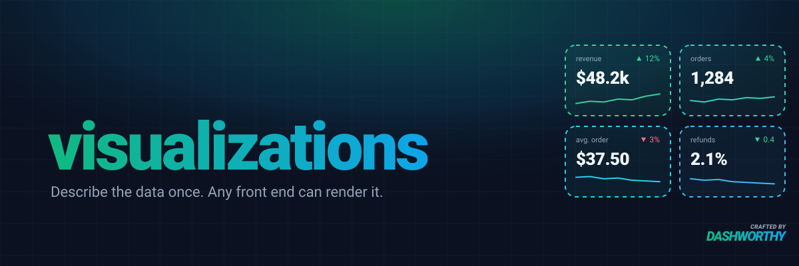

[](https://packagist.org/packages/dashworthy/visualizations)
[](https://github.com/dashworthy/visualizations/actions?query=workflow%3Arun-tests+branch%3A1.x)
[](https://github.com/dashworthy/visualizations/actions?query=workflow%3A"Fix+PHP+code+style+issues"+branch%3A1.x)
[](https://packagist.org/packages/dashworthy/visualizations)

A Laravel package for building data visualizations. Define DataGrids, Charts, and Metrics as PHP classes — the package handles query generation, filtering, sorting, pagination, and schema generation for your front end.

## Installation

```bash
composer require dashworthy/visualizations
php artisan vendor:publish --tag="visualizations-migrations"
php artisan migrate
```

## Quick Example

```php
use Dashworthy\Visualizations\DataGrids\Abstracts\DataGrid;
use Dashworthy\Visualizations\DataGrids\Columns\Number;
use Dashworthy\Visualizations\DataGrids\Columns\Text;

class UserDataGrid extends DataGrid
{
    public function getColumns(): Collection
    {
        return collect([
            Number::make('users.id', 'ID')->asRowKey(),
            Text::make('users.name', 'Name'),
            Text::make('users.email', 'Email'),
        ]);
    }

    public function getQuery(): Builder
    {
        return DB::table('users');
    }
}
```

```php
// routes/api.php
Route::dataGrid(UserDataGrid::class);
Route::chart(RevenueChart::class);
```

## Documentation

Full documentation is available at [the documentation site](https://visualizations.dashworthy.com).

## Testing

```bash
composer test
```

## License

The MIT License (MIT). Please see [License File](LICENSE.md) for more information.
