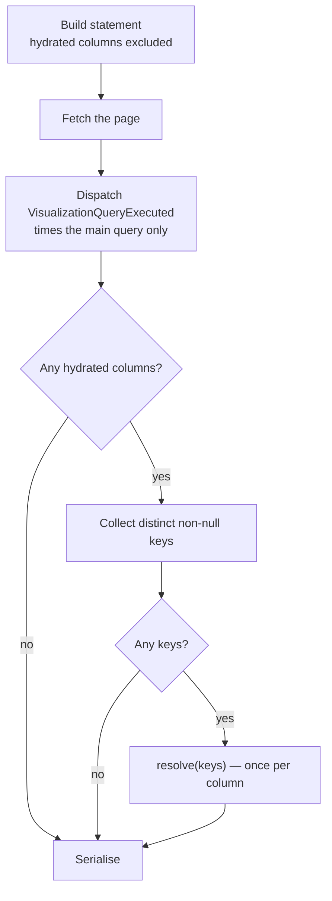

# Column Hydration

**Fills a data-grid column from a source the grid's own query cannot reach, resolving the whole page with one bulk query per column after the rows are fetched.**

---

## 🌟 Overview (plain-language)

A grid shows one row per thing — one row per user, say. Sometimes a column needs a value that lives somewhere the query cannot go: a second table attached many times over (every note written about that user), or another service entirely.

Joining it in does not work. Join `notes` to a grid of users and you get one row per note, so the grid stops being one row per user. A correlated subquery keeps the row count right — it is one statement, evaluated once per row inside the database — but its cost grows with the page, and it cannot reach a source outside the database at all.

A **hydrated column** takes the third route. It carries no SQL and contributes nothing to the grid's statement, yet still appears in `schema()['columns']` so the front-end renders it. It is filled *after* the page is fetched: the package collects the page's keys, hands them to a **hydrator** once, and writes the returned values onto the rows.

```php
// The grid declares the column…
Number::make('users.id', 'ID'),
Text::make('users.name', 'Name'),
HydratedColumn::for(UserNotesHydrator::class, 'Notes'),

// …and the hydrator resolves a whole page at a time.
class UserNotesHydrator implements HydratorContract
{
    public function keyedBy(): string { return 'ID'; }               // the field, as the grid declared it

    public function columnType(): ColumnType|string { return ColumnType::Text; }

    public function resolve(Collection $keys): array                  // one query, whatever the page size
    {
        return DB::table('notes')->whereIn('user_id', $keys)->get()
            ->groupBy('user_id')
            ->map(fn (Collection $notes): string => $notes->pluck('body')->implode('; '))
            ->all();
    }
}
```

Hydration adds one query per hydrated column, whatever the page size. (The absolute depends on the branch: a `first`/`last` request is 2 — the grid's and the hydrator's — while the default paginated request is 3, because `paginate()` issues its own count.)

The hydrator never sees the rows — it is handed keys and returns a map, so the N+1 this feature exists to avoid has nowhere to live.

A hydrator need not query at all. One that derives its values — mapping thresholds onto a number already selected, say — just returns the map. It receives each key once, so the derivation runs per distinct value rather than per row.

### What happens to a page



Every row gets the field, whether or not its key resolved: a key missing from the returned map, or a row whose own key is null, becomes `null`.

---

## 🛠 Technical reference

### Architecture

| Area | Unit | Responsibility |
|---|---|---|
| Boundary | `Contracts\HydratorContract` | The three things a hydrator declares: what keys it, what type it produces, how a page resolves. Owns no rows |
| Column | `DataGrids\Columns\HydratedColumn` | A `Column` carrying a hydrator instead of SQL. Never sortable or filterable; takes its type from the hydrator. Its `hydrate()` fills itself on a page: key extraction, dedupe, the single `resolve()` call, write-back — the only place a per-row query could have appeared |
| Statement | `Query\GenerateVisualizationQuery` | Excludes hydrated columns from the select, and from the field lookup a sort or filter resolves through |
| Seam | `DataGrids\Abstracts\DataGrid::hydrate()` | The one public step both the grid path and an export call. Finds each hydrated column's key among the grid's columns, then hands the page to the column |
| Generator | `make:hydrator` | Scaffolds a hydrator into `app/Hydrators/` |

### Declaring a column

`HydratedColumn::for()` takes a class-string or a ready instance:

```php
HydratedColumn::for(UserNotesHydrator::class, 'Notes');   // resolved through the container, lazily
HydratedColumn::for(new ThresholdHydrator, 'Status');     // held as given — a derivation, no query
```

A class-string is resolved on first use and memoised, not in `for()`: declaring a column constructs nothing, and a grid that ends up not hydrating never touches the container. A schema request does construct it — `toArray()` asks the hydrator for its column type — so a hydrator constructor cannot assume it only ever runs on a data request.

`Visualizable::make()` is `final` and demands a SQL expression, so `for()` is a separate named static. Calling the inherited `make()` on a `HydratedColumn` yields a hydrator-less column; `getHydrator()` throws a `LogicException` naming `for()` rather than letting a typed-property error surface.

### Boundaries & invariants

| Rule | Why, and what happens |
|---|---|
| `keyedBy()` names the field as the grid declared it — `'ID'`, not `'column_ID'` | The `column_` prefix is `Visualizable`'s business. `DataGrid` resolves the declared name against its own columns that the statement selects — a floating filter of the same name is not a column, so it does not count — and a name matching none throws, naming the field and the hydrator class |
| A hydrated column is never sortable or filterable | The value does not exist when the page is chosen, so a sort or filter could not be honoured. Enforced server-side, not just advertised: the schema flags tell the front-end, and `GenerateVisualizationQuery` additionally refuses to resolve the field, so a stale client asking for it is ignored like an unknown field |
| `resolve()` is called at most once per page, per hydrated column — and not at all when the page yields no keys | Not a per-page hook — an empty page, or one whose keys are all null, skips it entirely, so a hydrator cannot use it to warm a cache |
| Keys are `int` or `string` only | Those are the types PHP can index an array by. Anything else throws, naming the field and the type, rather than truncating a float or coercing a bool |
| A missing key, or a null key, yields `null` on that row | Never a missing property |
| An exception from `resolve()` propagates | A quietly wrong grid is worse than a failed request |
| Hydrated columns cannot key one another, and a hydrated column may not collide with the field it keys on | Both throw. The first holds no value yet; the second would overwrite the key in place, and any later hydrator on that key would read hydrated values as keys |
| Scoping is the hydrator's own job | This package holds no tenant or authorization context and never writes a hydration query; the source may have its own permission model. Return an empty map to decline the work without querying |
| Hydration is invisible to `VisualizationQueryExecuted` | It runs after the event, so `durationMs` times the main query alone — and a hydration failure 500s a request whose event already fired successfully |
| `getColumns()` is called once per grid instance | A data request needs the columns twice — once to build the statement, once to hydrate — and both must see the same column objects, or a hydrator's key would resolve against a separately built graph. Changed in this feature: a grid whose `getColumns()` varies with state now gets the first graph for the rest of the instance's life |

### Export parity — opt-in, and unenforced

`DataGrid::hydrate()` is public so an export ships the same values the grid displays:

```php
public function handleExport(DataGridDataRequest $request): JsonResponse
{
    $query = GenerateVisualizationQuery::make()->handle(
        $this->getQuery(), $this->getVisualizables(), VisualizationData::fromDataGridRequest($request),
    );

    return response()->json(['data' => $this->hydrate($query->get())]);
}
```

Because there is one implementation, the two paths cannot differ in *how* they hydrate. They can differ in *whether* they do. **`handleExport` is not part of this package** — the service provider routes it only if your grid happens to define the method. An export that never calls `hydrate()` ships an empty column, and nothing here can detect it. Exports are also expected to run queued, so an async export hydrates outside the request — a hydrator scoping to the current user or tenant has no such context there.

Reach the statement through `getVisualizables()`, as above, rather than building a second graph of your own — see the `getColumns()` invariant.

---

## 🚀 Development & testing

```bash
vendor/bin/pest tests/DataGrids/Columns/HydratedColumnTest.php  # the post-fetch fill, in isolation
vendor/bin/pest tests/DataGrids/Grids/DataGridHydrateTest.php   # resolving each hydrator's key on the grid
vendor/bin/pest tests/DataGrids/Grids/HydratedColumnGridTest.php # the success criteria, against a real second table
vendor/bin/pest tests/DataGrids/Grids/HydratingDataGridTest.php  # both branches of the grid data path
vendor/bin/pest                                                  # full suite
vendor/bin/phpstan analyse
vendor/bin/pint
```

Scaffold a hydrator:

```bash
php artisan make:hydrator UserNotesHydrator      # → app/Hydrators/UserNotesHydrator.php
```

Test fixtures live in `tests/Fixtures/DataGrids/`. `StaticHydrator` resolves from a fixed map and counts its calls, so the once-per-page guarantee is asserted without counting queries. `UserNotesHydrator` and `UserNotesDataGrid` are the real-query pair, backed by the `notes` table created in `tests/TestCase.php`.
