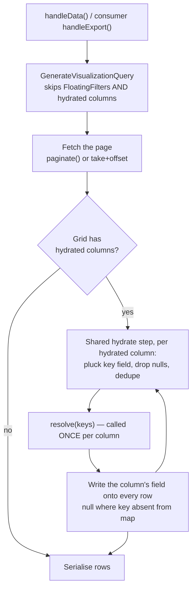

# Bulk Column Hydration — spec

**Date:** 2026-09-14
**Author:** Andrew Leach (@andyleach)
**Status:** Approved
**Origin:** signal (discovery)

## 0. ELI5

A data grid shows one row per thing — one row per order, say. Sometimes a column needs a value that
lives somewhere else, attached to that thing many times over: every note written about an order. You
cannot just grab it in the same database query, because asking for the notes changes what the query
returns — instead of one row per order you get one row per order-and-note, and every total on the
page is now wrong. You could ask separately for each row, but on a 250-row page that is 250 extra
questions.

So we let the grid ask **once, for the whole page**. The grid author declares a **hydrated column** —
a column that carries no SQL at all. After the page has been fetched, the small piece of code
attached to that column is handed every order id on the page at once, fetches what it needs in a
single query, and hands back a lookup table. The grid fills the column in from that table.

The design has one deliberate trick: that code is never shown the rows, only the list of ids. There
is physically nowhere to put a per-row query, so the slow version cannot be written by accident.

Because the column is its own type, three things take care of themselves: it is left out of the
database query (there is no SQL to run), it still appears in the schema the front-end renders from,
and it never claims to be sortable or filterable — because a value that does not exist when the page
is chosen cannot be sorted or filtered honestly.

We will know it worked when: hydrating a page costs the same number of queries whether the page
holds 1 row or 250; the on-screen grid and the export show the same values; and a hydrated column
never advertises a sort the server cannot honour.

## 1. Problem

A DataGrid column sometimes needs a value that cannot be selected inline, because joining its source
into the base query changes what the query fetches. A to-many relation multiplies rows, so the
statement stops returning one row per entity and starts returning one row per entity-relation pair —
corrupting pagination and any aggregate in the select. In the user's words, the join "breaks the
intent of the query… it no longer fetches what it intends to fetch."

The value is reachable with a correlated subquery, but that runs once per row and is prohibitively
inefficient at page scale.

Felt today by grid authors in consuming applications, who have three bad options: accept a broken row
unit, accept a per-row subquery, or drop the column. There is no fourth option in the package today.

**Why now:** the pattern has already been solved by hand once, downstream, in OroCommerce
(`oro/wastequip` !1070). The shape is proven; it belongs in the framework rather than being
re-derived per grid.

## 2. Users & stakeholders

| Role | Who | Stake |
|---|---|---|
| Primary user | The grid author — an app developer writing a `DataGrid` subclass in a consuming app | Writes hydrators; pays the ergonomic cost of the interface |
| Affected | End users viewing or exporting those grids | Must not see a blank or incorrect column, nor a sort/filter control that cannot work |
| Decides | @andyleach, package maintainer | Sign-off |

## 3. Goals & success criteria

| Criterion | How it's checked |
|---|---|
| Hydrating a page issues a fixed number of queries per hydrated column regardless of row count — a 250-row page costs the same as a 1-row page | Test asserting query count via `DB::listen` across a 1-row and a 250-row page for the same grid |
| The same rows come out of `handleData()` and a consumer's `handleExport()`; a hydrated column is never populated in one and blank in the other | Test exercising both paths through the shared hydrate step against one fixture grid, asserting identical hydrated values |
| A hydrated column's schema payload always reports `is_sortable: false` and `is_filterable: false`, and appears in `schema()` so the front-end renders it | Test asserting both flags false on a `HydratedColumn` and its presence in `DataGrid::schema()['columns']` |
| A hydrated column contributes no `selectRaw` to the generated statement | Test asserting the generated SQL for a grid with a hydrated column contains no alias for that column's field |
| Existing grids that declare no hydrated columns are unaffected | Existing test suite passes unchanged |

## 4. Constraints

- **PHP ^8.3**; **Laravel 11/12/13** (`illuminate/contracts ^11||^12||^13`).
- Grids are built on **`Illuminate\Database\Query\Builder`, not Eloquent** — hydration cannot assume
  models, relations, or an Eloquent collection.
- **No new required dependencies.**
- **Non-breaking.** Grids that hydrate nothing must be unaffected; nothing new becomes mandatory.
- **`Visualizable::__construct` and `::make()` are both `final`** (`src/Abstracts/Visualizable.php:26,40`)
  and take a SQL expression. A hydrated column has none. This work does not un-`final` them.
- **Hydrators declare their own key.** Not welded to `asRowKey()`, which is a front-end row-selection
  concern. A grid needs a key because it hydrates, not because the package demands one globally.
- **One hydrate step, shared.** `handleData()` and a consumer's `handleExport()` call the same
  implementation. Parity comes from there being one implementation, not from two paths kept in step
  by discipline.
- **The package holds no tenant or authorization context.** It never authors a hydration query.

## 5. Scope

**In:**

- A hydrated column type: a `Column` carrying no SQL expression, excluded from the generated
  statement, present in the schema, and display-only.
- A post-fetch stage running over the rows of the already-fetched page, before serialisation,
  shared by the data and export paths.
- Hydrators that issue one key-scoped bulk query.
- Hydrators that issue no query and derive values from a field already selected.
- A second exclusion in `GenerateVisualizationQuery` beside `FloatingFilter`.

**Out (non-goals):**

| Non-goal | Reason |
|---|---|
| Sorting or filtering hydrated values | The value does not exist when the page is chosen, so the sort or filter cannot be honoured. !1070 removed the `orderNotes` sorter for exactly this reason. Ruled out and enforced by the column type, not left to the author to remember. |
| Within-page PHP sorting | Ordering the visible slice tells the user the whole set is sorted when it is not. |
| Taking over export fetching | The package routes optional `handleExport` methods and will keep doing so; moving export's fetch into the package is a far larger change than this. |
| Row-level properties that are not columns | Oro's `row_class_name` is a reserved key its grid view reads, never a column. This package has no such contract, and inventing one alongside the column vehicle would mean two seams. Parked, not rejected on merit — see Deferred. |

**Deferred:**

| Item | Trigger to revive |
|---|---|
| Row-level hydrated values that are not columns (the `row_class_name` case) | A consuming grid needs a per-row value the front-end consumes without rendering it as a column, and `hidden()` + `withoutExport()` on a `HydratedColumn` proves insufficient |
| Hydration for Charts and Metrics | A chart or metric needs a value from a source its query cannot reach |
| A wall-clock latency budget for the hydration stage | A hydrated grid is observed slow despite a bounded query count |

## 6. Approach (from the design dialogue)

**Chosen: a dedicated hydrated column type carrying its hydrator, run by one shared post-fetch step.**

### Why a column type, and not a parallel hydrator list

The design dialogue first landed on hydrators declared separately on the DataGrid, cross-referenced
against columns at schema time. Review found two defects, both fatal:

1. **The select.** `GenerateVisualizationQuery` emits `selectRaw` for every non-`FloatingFilter`
   visualizable (`src/Query/GenerateVisualizationQuery.php:39-42`). A hydrated field has no SQL
   expression, so a column declared conventionally would emit a broken alias. Nothing in the parallel-list
   design made the field absent from the statement; the spec merely asserted it was.
2. **The schema.** A field reaches the front-end only by being in `getColumns()`. A hydrator declared
   outside the column set has no route to the rendered schema.

Making the hydrated field a **column type** fixes both at their source and removes the parallel
design's weakest element — the cross-referencing rule that collected hydrator fields, intersected
them with columns, and overrode the flags. A type enforces display-only in its own serialisation,
with nothing to reconcile.

### The boundary: `HydratedColumn` and `Hydrator`

Shaped via `using-codebase-design`. The shape is a **plain narrow resolver** behind a column — no
Gang-of-Four trigger genuinely fires (Strategy's requires a conditional selecting behaviour, and
there is none).

**`HydratedColumn` — the author-facing commitment.** A `Column` that carries a `Hydrator` instead of
a SQL expression. It is constructed through a named static (`Visualizable::make()` is `final` and
demands an expression, so the hydrated type cannot reuse it) which supplies an inert empty expression
never read, because the generator skips the column. It serialises like any column so the front-end
renders it, and always emits `is_sortable: false` / `is_filterable: false` whatever else it was told.

**`Hydrator` — the work.** Two commitments:

- the already-selected field its rows key on;
- a resolution step handed **every distinct key on the page at once, exactly once**, returning a
  key-to-value map. It is never handed the rows.

`field()` is not on the interface: the column owns the field, so the hydrator does not restate it.

**What a caller must know:** which field keys their rows, and how to turn a set of keys into a map.
Nothing else. The shared step owns key extraction, null-key discarding, deduplication, invoking
resolution once, and writing the field onto every row — `null` where a key is absent from the map.

**Rejected alternative shape — a row-set transformer** (`hydrate(rows): rows`), judged on the three
criteria:

| Criterion | Resolver (chosen) | Row-set transformer |
|---|---|---|
| Call-site simplicity | One `whereIn`, return a map | Every hydrator re-implements pluck / unique / group / assign |
| Hidden complexity | Hides key extraction, dedup, null handling, missing-key defaults, row writing | Hides nothing — a pass-through, shallow by definition |
| Misuse resistance | **N+1 is unrepresentable** — resolution receives every key at once, with nowhere to put a per-row query | A hydrator can loop rows and query inside the loop, and it looks fine |

Misuse resistance is decisive: it turns the query-count criterion from something tests hope for into
something the interface enforces.

**Two consequences worth stating:**

1. **Derivation needs no query.** A hydrator keyed on an already-selected field whose resolution maps
   distinct values to derived values touches no database, and receives *distinct* values — cheaper
   than per-row. PHP thresholds stay PHP constants.
2. **An authorization short-circuit needs no extra method.** !1070's `oro_note_view` early return is
   resolution returning an empty map: every row gets `null` and no query runs.

### Rejected approaches

| Approach | Why rejected |
|---|---|
| **Hydrators listed on the DataGrid, cross-referenced with columns** | The design dialogue's first pick. Broke the generated statement and never reached the rendered schema; see above. |
| **Event listeners, mirroring Oro directly** | Familiar and decoupled, but the package cannot know which fields a listener writes, so it cannot enforce display-only; and export parity reverts to depending on the consumer remembering to dispatch — the exact failure this work exists to design out. |

### Tenancy and authorization

The package never authors the hydration query — the consumer does, in their own application, where
their existing tenant scope and ACL already apply. The package therefore holds no tenant context and
must not appear to: resolution is plainly the author's query to write and to scope. !1070 is the
cautionary case — its follow-up query carried its own ACL-at-VIEW *and* organization scoping,
independent of the grid's own gate, because the hydration source has a security context the grid's
gate does not cover.

### Flow

No increments: the work lands in one pass.

## 7. Existing context

**`src/Query/GenerateVisualizationQuery.php:39-42`** — selects every non-`FloatingFilter`
visualizable. **The single line this work must change**: hydrated columns become a second exclusion,
or the generated statement breaks.

**`src/DataGrids/Abstracts/DataGrid.php`** — `handleData()` goes straight from `paginate()` (or
`take`/`offset` on the windowed branch) into `response()->json()`. **There is no seam today between
rows coming back and rows being serialised** — creating that seam is the core of this work.
`schema()` maps `getColumns()` to their arrays; a field reaches the front-end only through it. Both
data branches fire `VisualizationQueryExecuted`.

**`src/Abstracts/Visualizable.php:26,40`** — `__construct` and `make()` are both `final` and take a
SQL expression. This is why `HydratedColumn` needs its own named static rather than reusing `make()`.

**`src/DataGrids/Abstracts/Column.php`** — carries `isSortable`, `isFilterable`,
`isExcludedFromExport`, emitted by `toArray()`. `HydratedColumn` overrides the first two on
serialisation. `src/DataGrids/Columns/Chip.php` is the local precedent for a column type overriding
`toArray()` to resolve something at serialisation time.

**`src/VisualizationsServiceProvider.php:59-71`** — export is consumer-implemented: the provider only
routes optional `handleExport`, `handleExportStatus`, `handleExportDownload` if the grid defines
them. This is why parity cannot be assumed and must be delivered as one callable step.

**`src/Abstracts/FilterOperation.php`** — the package's existing idiom for an ordered processing stage
(`Illuminate\Pipeline` over a config-registered contract list). Prior art for stage shape, though
hydrators are declared per column rather than globally in config.

**Prior art — OroCommerce, `oro/wastequip` !1070.** `CybersourceOpenOrdersNotesListener` hooks
`OrmResultAfter`: reads the `id` off each already-fetched record, runs one follow-up query keyed by
those ids, groups by id in PHP, sets the value on each record. `o.customerNotes as orderNotes` was
dropped from the select and its sorter removed — a post-query aggregate is not a SQL column.
Grid/export parity was free there only because `OrmDatasource::getResults()` always dispatches
`result.after` and the export column set comes from grid config rather than the SQL select — a
property this package does not have. `CybersourceOpenOrdersRowClassListener` in the same MR writes
`row_class_name` as a grid property, never a column; that case is Deferred here (§5).

**Documentation consulted:** none — this repository has no `docs/` tree yet. The design was taken
from the source directly, plus the MR above.

## 8. Open questions

| Question | Position |
|---|---|
| What happens when a hydrator's resolution throws? | Default position: it propagates. Silently swallowing turns a broken hydration source into a quietly wrong grid, which is worse than a failed request. Not blocking; settle in plan. |
| May the key field name a field no column selects? | Current position: it must be a selected field, and a missing one fails loudly at that grid rather than silently producing all-null. Not blocking. |
| Should `VisualizationQueryExecuted` (or a sibling event) report hydration cost? | Unresolved. The event today reports the main query's SQL and duration; hydration would be invisible to anyone watching it. Raised, not decided. |
| Is a latency budget needed on the hydration stage? | Offered during discovery and declined in favour of the query-count bound alone. No number exists. Parked in §5 Deferred with its revival trigger. |
